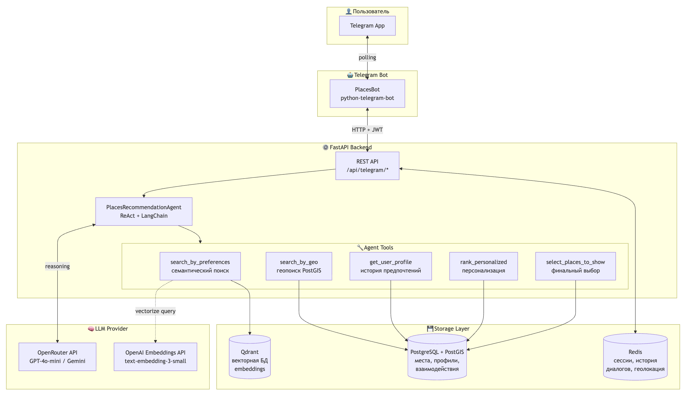
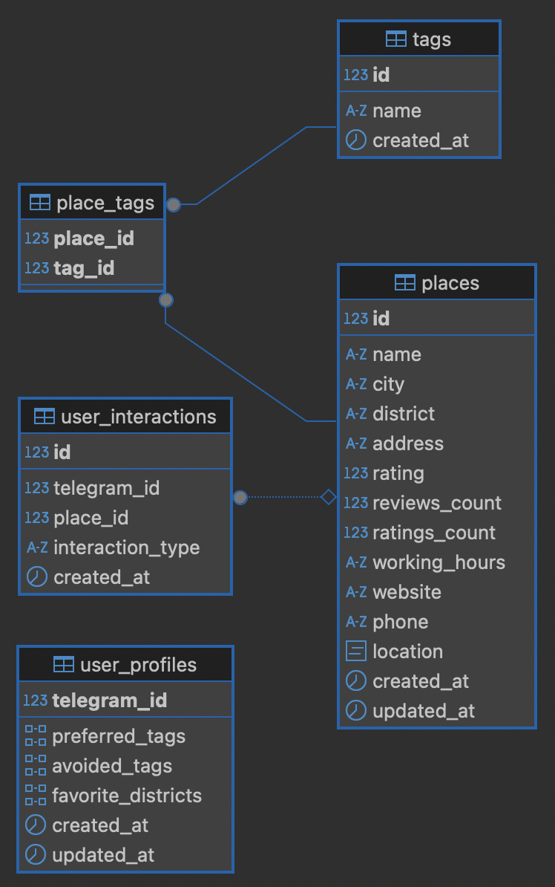

# RecSys Places of Rest

Сделал:
Копылов Михаил Юрьевич М8О-106СВ-25

LLM-агент для рекомендаций мест досуга в Москве через Telegram. База из 2GIS с семантическим поиском и персонализацией.

## Структура репозитория

```
RecSysOfPlacesOfRest/
├── backend/                      # FastAPI backend
│   ├── app/
│   │   ├── agent/               # LLM агент
│   │   │   ├── agent.py         # Агент
│   │   │   └── tools.py         # SearchTools (search, geo, profile)
│   │   ├── api/                 # API слой
│   │   │   ├── routes/          # Роуты
│   │   │   │   ├── auth.py      # JWT аутентификация
│   │   │   │   ├── telegram.py  # Telegram endpoints
│   │   │   │   └── health.py    # Health checks
│   │   │   ├── dependencies.py  # FastAPI dependencies
│   │   │   └── schemas.py       # Pydantic модели
│   │   ├── core/                # Ядро приложения
│   │   │   ├── config.py        # Pydantic Settings
│   │   │   ├── database.py      # DatabaseManager
│   │   │   ├── models.py        # SQLAlchemy ORM модели
│   │   │   ├── security.py      # JWT utilities
│   │   │   └── tracing.py       # Phoenix tracing
│   │   ├── middleware/          
│   │   │   └── rate_limit.py    # SlowAPI rate limiting
│   │   └── services/
│   │       └── session.py       # Redis session manager
│   └── main.py                  # FastAPI application
│
├── telegram_bot/
│   └── bot.py                   # Telegram Bot (python-telegram-bot)
│
├── database/                    # Скрипты инициализации БД
│   ├── schema_postgres.sql      # DDL: таблицы, индексы, функции
│   ├── load_to_postgres.py      # Загрузка CSV → PostgreSQL
│   └── generate_embeddings.py   # Генерация векторов → Qdrant
│
├── data/                        # Исходные данные
│   ├── places_cleaned.csv       # 60k+ мест
│   └── places_cleaned.json      # JSON формат
│
├── docker-compose.yml           # Orchestration всех сервисов
├── Dockerfile.backend           # Backend image
├── Dockerfile.bot               # Bot image
├── requirements.txt
└── env.example
```

## Архитектура



## Схема БД



## Как работает агент

LLM-агент построен на паттерне **ReAct** (Reasoning + Acting) с использованием LangChain.

**Инструменты агента:**
- `search_by_preferences` — семантический поиск по Qdrant (векторные эмбеддинги описаний)
- `search_by_geo` — географический поиск через PostGIS (радиус от точки)
- `get_user_profile` — загрузка профиля для персонализации
- `rank_personalized` — переранжирование с учётом предпочтений пользователя
- `select_places_to_show` — финальный отбор 3-7 мест

**Алгоритм работы:**
1. Анализ запроса → если неясен, задаёт уточняющий вопрос
2. Выбор инструмента поиска (семантика vs гео)
3. Получение кандидатов (до 50 мест)
4. Персонализация (если есть профиль)
5. Отбор лучших мест → ответ с карточками

**Персонализация** учитывает: preferred_tags, avoided_tags, favorite_districts, историю посещений.

## Технологии и библиотеки

| Категория | Технология | Назначение |
|-----------|------------|------------|
| **Web Framework** | FastAPI | Асинхронный REST API |
| | Pydantic | Валидация данных и схемы |
| **LLM / AI** | LangChain | Оркестрация LLM агента |
| | OpenAI API | GPT модели |
| **Базы данных** | PostgreSQL + PostGIS | Реляционные данные и геопоиск |
| | Qdrant | Векторная БД для семантического поиска |
| | SQLAlchemy + GeoAlchemy2 | ORM |
| **Кэширование** | Redis | Сессии |
| **Безопасность** | PyJWT | JWT аутентификация |
| | SlowAPI | Rate limiting |
| **Мониторинг** | Phoenix | LLM трейсинг |
| **Telegram** | python-telegram-bot | Telegram Bot API |
| **Инфраструктура** | Docker Compose | Оркестрация контейнеров |

## Деплой

### Шаги

```bash
git clone <repo-url>
cd RecSysOfPlacesOfRest

cp .env.example .env
nano .env  # Указать обязательные переменные

# Базы данных
docker compose up -d postgres qdrant redis

# Загрузка данных (первый раз)
pip install -r backend/requirements.txt
python database/load_to_postgres.py
python database/generate_embeddings.py

# Сервисы
docker compose up -d backend telegram_bot

# Health check
curl http://localhost:8000/api/health

# Логи
docker compose logs -f

# Статус
docker compose ps
```

